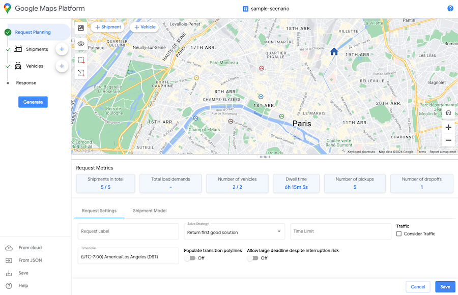

# Google Fleet Routing App

A web application to explore the capabilities of
the [**Cloud Fleet Routing**](https://cloud.google.com/optimization/docs/overview) (CFR) feature of
Google **Cloud Optimization API**.

CFR solves vehicle routing problems (VRPs).
Given a set of *shipments* with locations,
a set of *vehicles* to carry out deliveries,
costs and additional constraints;
CFR works to find an optimal solution with efficient routes
where every shipment is delivered by a vehicle,
with all constraints met and minimal cost.

This application presents the properties
of the CFR data model as interactive forms, tables, and maps.
Users may find it a helpful way to familiarize themselves
with the data model and functions of the API.
Before writing any code, use the application to construct CFR scenarios,
tune constraint parameters, visualize routes, and more.

<https://cloud.google.com/optimization>

## Intended Use

The application is intended to be used as an exploratory tool
and should not be deployed in any production critical path.
Google provides this application for users to try out the API and understand
how to model their use cases in CFR.
But customers should implement their own solutions
to integrate Cloud Fleet Routing into their business processes.

## Billing
The resources and API usage generated by the application are billed to the project owner.
*Fleet Routing App is not free to use.*
Customers can expect ongoing charges related to cloud resources
(compute, networking, storage, etc.),
along with usage-based charges for the Maps Platform APIs and Cloud Fleet Routing.
When running locally for development,
the application will still incur usage-based charges for Maps and CFR.

In order to deploy the application to a project,
the project must be linked to a valid **Google Cloud Billing Account**.
The customer is responsible for all charges accrued on the account.

> ⚠️ The application and Cloud Fleet Routing perform several kinds of batch operations.
> This means it can be easy to rack up a high volume of usage in a short period of time,
> especially for large scenarios with many shipments.
> Familiarize yourself with the pricing models for Maps Platform and Cloud Fleet Routing
> before using the application and routinely monitor the charges on your billing account.
>
> Keep scenarios small to begin with and get comfortable with the billing model
> before attempting to solve large scenarios which may be expensive.

### Pricing
Refer to the following pricing guides for Cloud, Maps, and CFR for detailed costs:
- [Google Cloud Platform Pricing](https://cloud.google.com/pricing)
- [Google Maps Platform Pricing](https://mapsplatform.google.com/pricing/)
- [Cloud Fleet Routing Pricing](https://cloud.google.com/optimization/pricing)

> ⚠️ GCP and GMP offer "getting started" and "free tier" credits that may cover
> a small amount of usage for free. However, as mentioned in the previous section,
> large scenarios can rack up a lot of spend in a short period of time.
> If you are not careful, it is possible to use up all of your credits
> with just a few large scenarios.

## License
Code is license under an MIT-style license,
see [LICENSE](LICENSE) for details.

## Terms of Use
The application is subject the following terms of use:
- [Google Cloud Platform Terms of Use](https://cloud.google.com/terms)
- [Google Maps Platform Terms of Use](https://cloud.google.com/maps-platform/terms)
- [Google Cloud Optimization API service-specific terms](https://cloud.google.com/optimization/docs/tos/service-terms)
- [Google OAuth 2.0 Policies](https://developers.google.com/identity/protocols/oauth2/policies)

---
## Deploy an Instance

To deploy a containerized instance of the application from **Google Artifact Registry**,
follow the steps in the project setup and deployment guides:

- **[Project Setup](docs/project.md)**  
  Create and configure a GCP project with the prerequisites to deploy Fleet Routing App.
- **[Deployment Guide](docs/deployment.md)**  
  Deploy an instance of Fleet Routing App into your GCP project.

---
## Local Development

To run a local instance of the application on your machine,
follow the steps in the project setup and development guides:

- **[Project Setup](docs/project.md)**  
  Create and configure a GCP project with the prerequisites to run Fleet Routing App.
- **[Development Guide](docs/development.md)**  
  Run Fleet Routing App in your local Node.js environment.

---
## User Guide
Instructions for how to use the application are available in the
[User Guide](application/frontend/src/assets/docs/documentation.md).

This guide can also be accessed by clicking the
"app help docs" link on the application's landing page
or "❔ Help" button in the lower-left corner
of the main application window.
